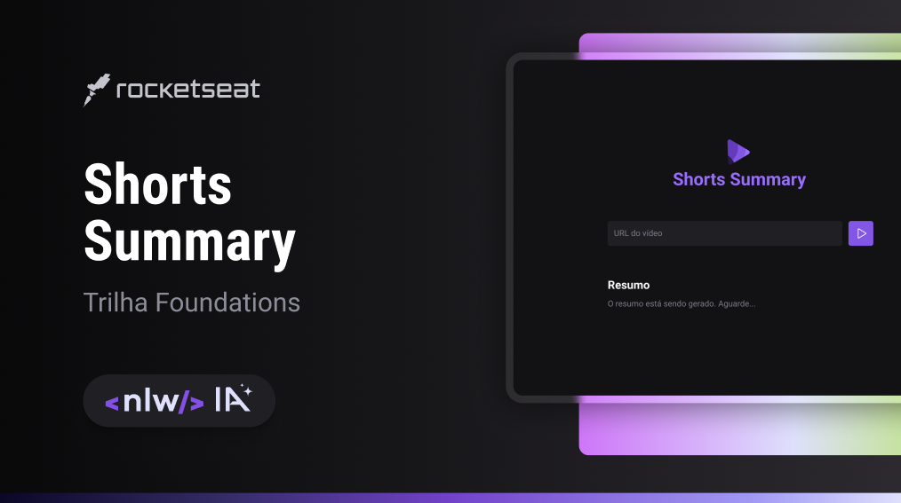

## Screenshots

# NLW-IA SHORTS SUMMARY

Shorts Summary é uma aplicação web para criar resumo de vídeos shorts do Youtube utilizando Inteligência Artificial para transcrever o conteúdo do vídeo e realizar o resumo do conteúdo. Esse projeto é desenvolvido na trilha Foundations na edição NLW IA 2023.

## Técnologias Usadas

- HTML
- CSS
- JavaScript
- Node JS
